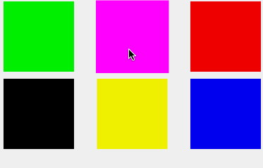

[](https://travis-ci.org/badoo/BMACollectionViewLayouts)

# BMACollectionViewLayouts

A set of UICollectionView subclasses for all your layouting needs.

##Installing
You can use cocoapods, importing BMACollectionViewLayouts:
```ruby
pod 'BMACollectionViewLayouts'
```

You can also import this repository as a submodule and use the classes under 'Source' subdirectory.

##The Layouts
There is only one layout at the moment, but more are coming :rocket:

##BMAReorderableFlowLayout
This is a flow layout subclass, and allows user to drag and drop the elements inside the collection view.

The layout gives callbacks for all events in time during this interaction, and lets you control if the whole reordering is available for a single or all cells.

```objectivec
/// Return YES if the item can be dragged. Default assumed NO.
- (BOOL)collectionView:(UICollectionView *)collectionView canDragItemAtIndexPath:(NSIndexPath *)indexPath;

/// Return YES if the item can be moved from the position to the position. Default assumed NO.
- (BOOL)collectionView:(UICollectionView *)collectionView canMoveItemFromIndexPath:(NSIndexPath *)indexPath toIndexPath:(NSIndexPath *)toIndexPath;

/// Reported if item can be moved, after animation happened
- (void)collectionView:(UICollectionView *)collectionView didMoveItemFromIndexPath:(NSIndexPath *)indexPath toIndexPath:(NSIndexPath *)toIndexPath;

/// Notifies that a cell has been selected and will begin dragging it
- (void)collectionView:(UICollectionView *)collectionView layout:(UICollectionViewLayout *)collectionViewLayout willBeginDraggingItemAtIndexPath:(NSIndexPath *)indexPath;

/// Notifies that a cell has been selected and did begin dragging it. Called after animations before dragging
- (void)collectionView:(UICollectionView *)collectionView layout:(UICollectionViewLayout *)collectionViewLayout didBeginDraggingItemAtIndexPath:(NSIndexPath *)indexPath;

/// Notifies that a cell previously being dragged will end dragging
- (void)collectionView:(UICollectionView *)collectionView layout:(UICollectionViewLayout *)collectionViewLayout willEndDraggingItemAtIndexPath:(NSIndexPath *)indexPath;

/// Notifies that a cell previously dragged has been dropped to it's destination. Called after all animations.
- (void)collectionView:(UICollectionView *)collectionView layout:(UICollectionViewLayout *)collectionViewLayout didEndDraggingItemAtIndexPath:(NSIndexPath *)indexPath;

```

A useful feature is the ability to hook in the animation of the actual cell being dragged. It is generally necessary to indicate visually that the collection view is letting the user to drag the cell, but the design should be up to you. So there are two callbacks you can implement for that effect:

```objectivec
/// Gives possibility to customise the animation of the cell when it's selected for dragging
- (BMAReorderingAnimationBlock)animationForDragBeganInCollectionView:(UICollectionView *)collectionView layout:(UICollectionViewLayout *)collectionViewLayout;

/// Gives possibility to customise the animation of the cell when it's dropped after dragging
- (BMAReorderingAnimationBlock)animationForDragEndedInCollectionView:(UICollectionView *)collectionView layout:(UICollectionViewLayout *)collectionViewLayout;

```

An example of a simple pop-out animation:
```objectivec
- (BMAReorderingAnimationBlock)animationForDragBeganInCollectionView:(UICollectionView *)collectionView layout:(UICollectionViewLayout *)collectionViewLayout {
    return ^(UICollectionViewCell *draggedView){
        draggedView.transform = CGAffineTransformMakeScale(1.3, 1.3);
    };
}

- (BMAReorderingAnimationBlock)animationForDragEndedInCollectionView:(UICollectionView *)collectionView layout:(UICollectionViewLayout *)collectionViewLayout {
    return ^(UICollectionViewCell *draggedView){
        draggedView.transform = CGAffineTransformIdentity;
    };
}
```

And how it looks like:



###Important

The layout needs to copy the cell in order to create a view it can move around. It does this instead of creating the snapshot, as you may want to reconfigure your cell for dragging before it actually moves. So you need to implement NSCopying in your cell and return a valid copy.
